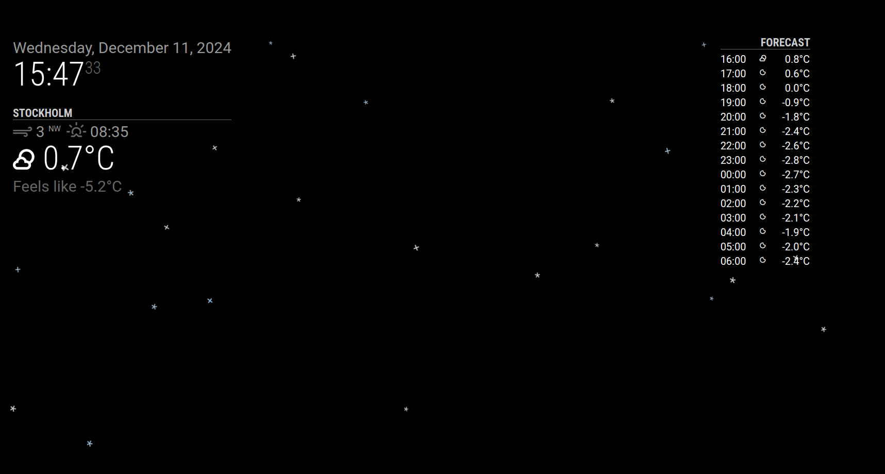
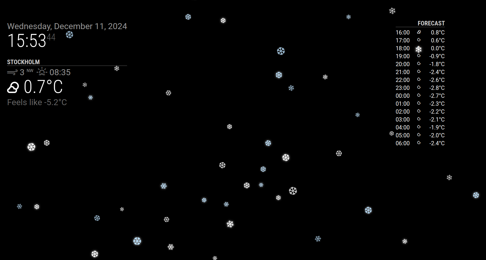

# MMM-SnowEffect

A MagicMirror² module that adds gentle falling snow to your mirror. Perfect for creating a winter atmosphere!

Version: 2.0.1

## Changelog

### v2.0.1 (2024-12-16)
- Removed performance presets system
- Simplified configuration with direct values
- Updated documentation

### v2.0.0 (2024-12-16)
- Moved all configuration to config.js
- Added comprehensive validation
- Improved error handling

### v1.0.0 (2024-12-01)
- Initial release

## Effect Preview

### Light Performance Example


### Rich Performance Example


## Key Features
- Beautiful falling snowflakes (white and light blue mix)
- Fully configurable through config.js
- Minimal impact on other modules
- Simple installation

## Important Note About This Module
Unlike typical MagicMirror modules that display in specific positions (like `top_right` or `bottom_left`), this module works differently:
- It covers your entire mirror surface
- The snow falls across all other modules
- It doesn't interfere with other modules' functionality
- It must be set to `position: "fullscreen_above"` to work properly

Think of it as an overlay that adds a snowy atmosphere to your entire MagicMirror.

## Installation

### Step 1: Clone the Module
```bash
cd ~/MagicMirror/modules
git clone https://github.com/cgillinger/MMM-SnowEffect.git
```

### Step 2: Add to Config
Add to your `config/config.js` file. Here are some example configurations:

### Basic Configuration (Light Performance)
```javascript
{
    module: "MMM-SnowEffect",
    position: "fullscreen_above",    // This position is required!
    config: {
        flakeCount: 25,
        characters: ['*', '+'],
        sparkleEnabled: false,
        minSize: 0.8,
        maxSize: 1.5
    }
}
```

### Enhanced Configuration (Rich Performance)
```javascript
{
    module: "MMM-SnowEffect",
    position: "fullscreen_above",
    config: {
        flakeCount: 50,
        characters: ['❄', '❆'],
        sparkleEnabled: true,
        minSize: 1.0,
        maxSize: 2.0
    }
}
```

### Custom Configuration
You can mix and match any settings:

```javascript
{
    module: "MMM-SnowEffect",
    position: "fullscreen_above",
    config: {
        flakeCount: 30,          // Custom flake count
        characters: ['*', '❄'],  // Mix of simple and fancy characters
        sparkleEnabled: true,    // Enable sparkle effect
        minSize: 0.5,            // Custom size range
        maxSize: 2.0,
        speed: 1.5              // 50% faster than normal
    }
}
```

### Configuration Options

| Option | Description | Default | Range/Values | Notes |
|--------|-------------|---------|--------------|-------|
| `snow` | Enable/disable effect | true | boolean | For temporary disable |
| `flakeCount` | Number of snowflakes | 25 | 1-100 | More flakes = more CPU |
| `speed` | Fall speed multiplier | 1.0 | 0.1-5.0 | Higher = faster falling |
| `minSize` | Minimum flake size | 0.8 | 0.1-5.0 | In rem units |
| `maxSize` | Maximum flake size | 1.5 | 0.1-5.0 | In rem units |
| `characters` | Snowflake characters | ['*', '+'] | array | Any characters |
| `sparkleEnabled` | Enable sparkle effect | false | boolean | Affects performance |

## Performance Guidelines

### For Low-Power Devices (e.g., Raspberry Pi):
- Keep `flakeCount` around 25 or less
- Use simple characters (`*` and `+`)
- Set `sparkleEnabled: false`
- Use smaller sizes (0.8 to 1.5 range)

### For Powerful Devices:
- Can increase `flakeCount` up to 50
- Can use Unicode snowflakes (❄ and ❆)
- Can enable sparkle effects
- Can use larger sizes (1.0 to 2.0 range or more)

## Troubleshooting

### Common Issues

1. **High CPU Usage**
   - Reduce `flakeCount`
   - Use simple characters
   - Disable sparkle effect
   - Use smaller size range

2. **Snow Not Visible**
   - Verify `position: "fullscreen_above"` in config
   - Check if the module is listed in your config
   - Make sure snow: true is set

3. **Choppy Animation**
   - Reduce `flakeCount`
   - Use simpler characters
   - Disable sparkle effect
   - Check system performance

4. **Module Crashes**
   - Start with basic configuration
   - Gradually add features
   - Update MagicMirror to latest version

## Compatibility
- MagicMirror²: >= 2.20.0
- Works on all devices (performance varies)
- Major browsers supported

## Contributing
Found a bug or want to suggest improvements? Please [create an issue](https://github.com/cgillinger/MMM-SnowEffect/issues).

## Credits
- Created by Christian Gillinger
- Based on MagicMirror² by Michael Teeuw (https://github.com/MichMich)

## License
MIT License - see the [LICENSE](LICENSE) file for details